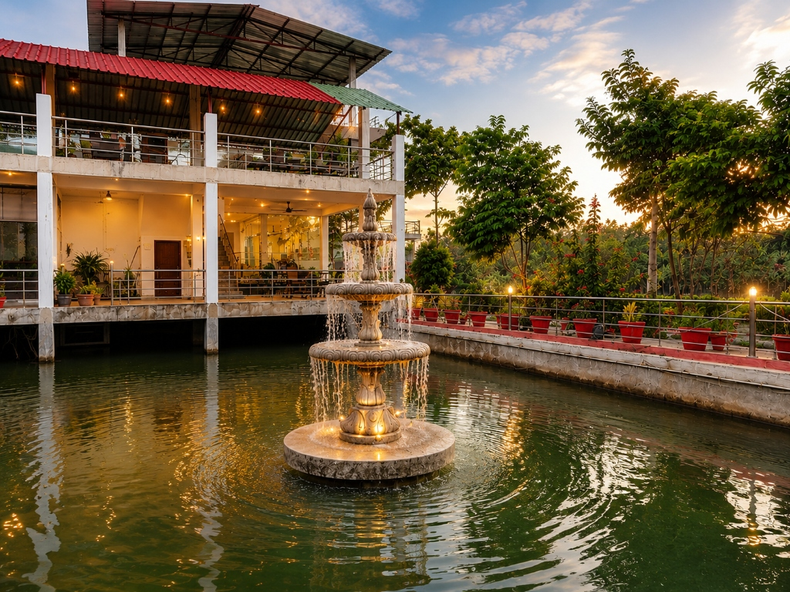

# 🏰 Gona Hotel, Fine Dining Restaurant & Luxury Farm House

Welcome to the official repository for **Gona Hotel & Estate** — a modern, responsive, full-stack web platform built for luxury hotel room bookings, fine dining food ordering, and private farm house reservations.



---

## 🔐 Admin Panel Credentials / एडमिन लॉगिन जानकारी

Yes, this project includes a complete **Admin Dashboard** for hotel operations, booking management, menu edits, and analytics.

| Access Type | URL Path / Route | Email ID | Default Password |
| :--- | :--- | :--- | :--- |
| 🛡️ **Admin Portal** | `http://localhost:5173/admin` | `admin@gonahotel.com` | `admin123` |
| 👤 **Guest Account** | `http://localhost:5173/login` | `guest@gonahotel.com` | `guest123` |

> 💡 **Note**: Logging in with `admin@gonahotel.com` unlocks full access to the Admin Dashboard located at [http://localhost:5173/admin](http://localhost:5173/admin).

---

## 🌟 Key Features

- **🏨 Luxury Room Bookings**: Explore rooms, view high-res galleries, check real-time availability, and book stays.
- **🍽️ Fine Dining Restaurant**: Interactive food menu with category filters, cart management, coupons, and table/delivery checkout.
- **🏡 Private Farm House Estate**: Dedicated booking portal for full farm house stays, pool picnics, BBQ nights, and celebration lawns.
- **📱 UPI QR & App Direct Payments**: Native integration for UPI QR scanning (PNB Gateway) and 1-click payment via Google Pay, PhonePe, Paytm, and BHIM (`7880729819m@pnb`).
- **📞 Direct Hotel Concierge**: Integrated 24/7 phone hotline (`+91 78807 29819`) and instant WhatsApp reservation desk.
- **🧾 Instant GST Invoices**: Automatic tax invoice generation with PDF print capabilities.
- **📊 Full Admin Dashboard**: Comprehensive admin portal for managing room reservations, food orders, farm bookings, menu pricing, discount coupons, and revenue analytics.

---

## 📊 Admin Dashboard Features

1. **Revenue Analytics**: Track total room earnings, restaurant food sales, and live reservation counts.
2. **Room Management**: Edit room prices per night, toggle availability, and update descriptions.
3. **Room Bookings**: View incoming guest reservations, check-in/check-out dates, and payment statuses.
4. **Restaurant Menu Management**: Update food items, change dish prices, toggle dish availability.
5. **Kitchen Food Orders**: Live tracking of food orders (Preparing, Out for Delivery, Delivered).
6. **Coupon Management**: Create and manage discount codes (e.g. `GONA20`, `WELCOME10`).
7. **Customer Database**: View registered user accounts and phone numbers.

---

## 🛠️ Tech Stack

### **Frontend**
- **Framework**: React 19 + TypeScript + Vite
- **Styling**: TailwindCSS + Lucide Icons + Framer Motion
- **State & Routing**: React Router v7 + Context API

### **Backend**
- **Runtime**: Node.js + Express + TypeScript
- **Database**: MongoDB (Mongoose) with seamless fallback
- **Authentication**: JWT & Bcrypt

---

## 🚀 Quick Start Guide

### 1. Clone the repository
```bash
git clone https://github.com/sivampandey/Gona_Hotel.git
cd Gona_Hotel
```

### 2. Install Dependencies & Start Backend
```bash
cd backend
npm install
npm run dev
```

### 3. Install Dependencies & Start Frontend
```bash
cd ../frontend
npm install
npm run dev
```

Open [http://localhost:5173](http://localhost:5173) in your browser.

---

## 📄 License
Created for Gona Hotel & Resort. All rights reserved.
